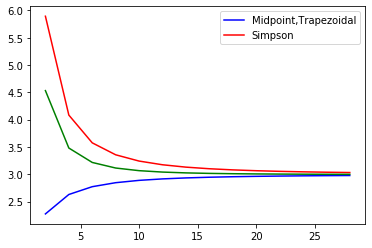

## 심슨 규칙
예시로 삼차함수인 x^3+2*x^2+4를 0부터 2 까지 심슨법으로 적분해본 결과 17.33333으로 실제 정적분 값과 같은 결과가 나온다

심슨 법은 error bound에서 사계도 함수가 0 이되는  삼차함수까지는 실제 정적분값과 똑같은 결과가 나오기 때문에 실제로 n값을 어떻게 변화시키더라고 값이 같게 나오는 것 확인 할 수 있다 


```python
def f(x):
  return x**3+2*x**2+4
def simpson(f,a,b,n):
  if n%2 is not 0:
    return None
  h=(b-a)/n
  first=f(a)
  last=f(b)

  x=a
  sum=0
  for i in range(n-1):
    x+=h
    fvalue=f(x)
    if i%2==0:
      sum+=4*fvalue
    else:
      sum+=2*fvalue
  integral=(h/3)*(first+sum+last)
  return integral
print(simpson(f,0,2,8)) 
```

    17.333333333333332
    

## 사다리꼴 근사
예시로 x^3+2*x^2+4   0부터 2까지 n=8로 적분       


```python
def f(x):
    return x**3+2*x**2+4
def trapezoidal(f,a,b,n):
    h=(b-a)/n
    first=f(a)
    last=f(b)
    x=a
    sum=0
    for i in range(n-1):
        x+=h
        fvalue=f(x)
        sum+=2*fvalue
    integral=(h/2)*(first+sum+last)
    return integral
print(trapezoidal(f,0,2,8))
```

    17.4375
    

## 중간점 근사
예시로 x^3+2*x^2+4   0부터 2까지 n=8로 적분


```python
def f(x):
    return x**3+2*x**2+4
def midpoint(f,a,b,n):
    h=(b-a)/n
    first=f((2*a+h)/2)
    x=(2*a+h)/2
    sum=0
    for i in range(n-1):
        x+=h
        fvalue=f(x)
        sum+=fvalue
    integral=h*(first+sum)
    return integral
print(midpoint(f,0,2,8))
```

    17.28125
    

## 중간점 근사
여려가지 적분법들의 근사값이 n에따라 어떻게 바뀌는지 시각적으로 비교해보자

삼차 이하의 다항함수의 경우 심슨규칙에 의한 근사는 일정한 상수함수만 나올 것이므로 함수 1/x로 확인해본다

0.5부터 10까지 적분할 때 n에따라 각 방법 별로 근사되는 적분값들을 그래프로 비교해보면 N이 커지면 커질수록 각 근사 방법들이 서로 비슷한 결과를 도출해냄을 시각적으로 확인할 수 있다


```python
import numpy as np
import matplotlib.pyplot as plt
def f(x):
    return 1/x
y1,y2,y3=[],[],[]
for i in range(2,30,2):
    mid=midpoint(f,0.5,10,i)
    trap=trapezoidal(f,0.5,10,i)
    sim=simpson(f,0.5,10,i)
    
    y1.append(mid)
    y2.append(trap)
    y3.append(sim)
t=np.arange(2,30,2)
np.array(y1)
np.array(y2)
np.array(y3)
plt.plot(t,y1,'b')
plt.plot(t,y2,'r')
plt.plot(t,y3,'g')
plt.legend(('Midpoint,''Trapezoidal','Simpson'))
plt.show()
```




